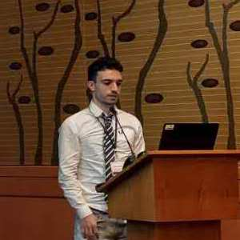

 

### This is a list of in-person talks I've given:

---

    

      
 
      21st June 2023   <strong>Mining Geospatial Relationships from Text</strong>   SIGMOD 2023, Seattle, WA 

---

    

      
 
      24th April 2023   <strong>Entity Resolution</strong>   Nanyang Technological University, Singapore 

<!--- | 24th April 2023 - "Entity Resolution", Nanyang Technological University, Singapore |  | --->

